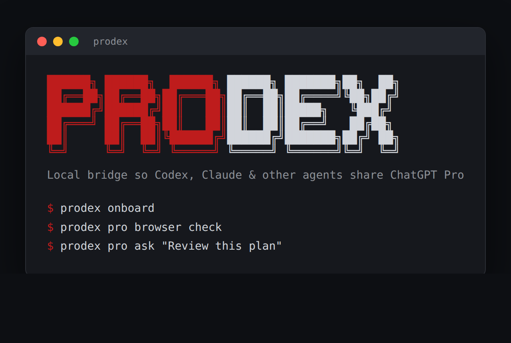

<div align="center">



**Local bridge so Codex, Claude, and other coding agents can share your logged-in ChatGPT Pro — with durable receipts.**

[](LICENSE)
[](package.json)
[](https://github.com/youdie006/prodex/actions/workflows/ci.yml)
[](#)

</div>

---

`prodex` is a local receipt bus plus MCP bridge for coordinating Codex execution with ChatGPT Pro/Projects and Claude.

The goal is not to turn ChatGPT Pro into a public API. The goal is to make Codex the main workbench while keeping durable receipts for every outside consult or handoff:

- Ask ChatGPT Pro from Codex when a stronger planning/review pass is useful.
- Let ChatGPT Projects hand structured tasks to Codex/local tools through an optional HTTP MCP bridge.
- Let Claude create/fetch the same tasks through stdio MCP.
- Keep durable records of what was asked, what was returned, and what Codex did with it.

## Quickstart: a Pro second opinion from your terminal

The most common way to use `prodex` is standalone — get a ChatGPT Pro answer on a file or question without leaving the terminal, using the Pro reasoning you already pay for. No MCP setup required.

```bash
npm install -g @youdie006/prodex          # needs Node 20+, git, ripgrep

prodex pro browser login                  # opens a dedicated Chrome; log in to ChatGPT there
prodex pro browser ask --file src/auth.ts "Review this for security holes"
```

The answer prints to your terminal and is saved under `.bridge/` for later. `prodex` drives the picker you can see and deliberately will not send into a window you cannot watch — but a dedicated Chrome window left non-minimized (even behind your editor) counts as watchable, so it sends quietly in the background without stealing focus. Just don't minimize it or switch that window to another tab. Add `--pro-mode 확장` for extended reasoning, or `--file` more than once to attach several files. See [First Pro Login](#first-pro-login) for the full flow, and the [FAQ](#faq) if a send stops.

## Core Shape

```text
Codex
  | pro ask preview / tasks / mcp
  v
prodex local bridge + .bridge receipts
  |                         ^
  | optional explicit       | optional HTTP/stdin MCP
  | pro browser consult     |
  v                         |
ChatGPT Pro              ChatGPT Projects / Claude
```

## Operating Rules

- Manual-first: each ChatGPT Pro consult should be user-initiated or clearly tied to the current task.
- Browser automation is optional and explicit: use it only through `pro browser ...`, with a real visible logged-in browser session.
- Stop on blockers: login, captcha, rate limit, Cloudflare, permission, and model-limit states stop the workflow.
- No bypass: no hidden API, cookie extraction, stealth automation, proxies, or captcha solving.
- Low volume: no batch prompting or recurring loops that make ChatGPT Pro behave like an API server. Visible-browser sends are auto-throttled to human pace (one every 10s by default; tune with `PRODEX_MIN_SEND_INTERVAL_MS`, `0` to disable).
- Local only: do not expose account access, browser sessions, or bridge endpoints to other users.
- Local debug port: the visible-browser adapter uses Chrome's `--remote-debugging-port`, which is unauthenticated but bound to `127.0.0.1` only and live only while that browser is open.

## Components

- `docs/clients.md`: connect Cursor, Gemini CLI, Codex, Claude, and other MCP agents to the ChatGPT Pro bridge.
- `docs/http-mcp.md`: ChatGPT Project HTTP MCP setup and safety notes.
- `docs/claude.md`: Claude stdio MCP setup and tool notes.
- `.bridge/`: local task/result/session/artifact/receipt storage.

## Package Surface

The npm package is CLI-only for now. The supported public surfaces are the `prodex` command, the stdio MCP server, and the optional HTTP MCP server. JavaScript imports from `prodex` or `prodex/dist/*` are intentionally not exported until a library API is designed and documented.

## Status

Implemented:

- Versioned `.bridge` ledger schemas for tasks, results, sessions, and receipts.
- CLI commands for task creation/listing/inspection/claiming/completion/blocking and result display.
- `pro ask` and `pro latest` for Codex-first consult previews and review receipts.
- `sessions list` and `sessions show` for inspecting dry-run, running, done, or blocked consult sessions.
- `receipts list` and `receipts show` for inspecting the local action ledger without exposing legacy inline write payloads.
- Ledger MCP tools for creating, claiming, completing, blocking, and inspecting task/result/session/receipt records from Claude or ChatGPT Projects.
- Read-only result artifact fetch for Pro consult and generic MCP handoff artifacts explicitly listed on result records.
- Explicit local reseal for legacy signed result receipts after reviewing the current result payload.
- `pro browser login/check/smoke/ask` for the optional visible browser adapter.
- Claude-compatible stdio MCP server through `prodex mcp`.
- ChatGPT Developer Mode-style Streamable HTTP MCP server through `prodex setup` and `prodex start`.
- Read-only repo tools for bounded file reads and ripgrep search.
- Receipt-gated repo write/stage tools for existing text files: dry-run first, apply only with matching git HEAD and preimage hash, then stage only reviewed applied receipts.
- `doctor` local health check for `.bridge`, redacted config loading, receipt-backed write/apply/stage, and the real HTTP MCP tool catalog.

Not implemented:

- Hidden ChatGPT endpoints.
- Cookie, token, localStorage, or sessionStorage extraction.
- Direct ungated write tools.
- Shell execution tools.
- Automatic public tunnel setup.

## Quick Start

Requires Node.js 20 or newer, `git`, and `ripgrep` (`rg`) on PATH. The optional visible-browser adapter also needs a Chromium-family browser (`google-chrome`, `chromium`, `chromium-browser`, `microsoft-edge`, `brave-browser`) or `PRODEX_CHROME=/path/to/browser`.

Install from npm — **note the scope**. The unscoped `prodex` on npm is an unrelated third-party package; do **not** install it. Use the scoped name:

```bash
npm install -g @youdie006/prodex
```

The `prodex` command is then on your PATH:

```bash
prodex onboard
prodex init
prodex doctor
prodex pro ask --cwd /absolute/path/to/your/repo "Review the project positioning"
```

For a source checkout:

```bash
cd /absolute/path/to/prodex
npm install
npm run build
SOURCE_CLI="/absolute/path/to/prodex/dist/cli.js"
node "$SOURCE_CLI" onboard --source-cli "$SOURCE_CLI"
node "$SOURCE_CLI" init
node "$SOURCE_CLI" doctor --source-cli "$SOURCE_CLI"
node "$SOURCE_CLI" pro ask --cwd /absolute/path/to/your/repo "Review the project positioning"
```

The examples below use the installed `prodex` binary. In a source checkout, replace `prodex` with `node /absolute/path/to/prodex/dist/cli.js` after building, and pass `--source-cli /absolute/path/to/prodex/dist/cli.js` to onboarding, browser, prompt, and local MCP troubleshooting commands so their follow-up guidance stays in source-checkout form.
`onboard` prints the Claude, ChatGPT Project, and optional ChatGPT Pro consult commands without changing local state.

`init` creates the local `.bridge/` ledger directories and ignore rules. On a source checkout it may also add `node_modules/` and `dist/` to the repo root `.gitignore` so local dependencies and build output stay out of git.
Run `init` from the repo root, or use `prodex init --cwd /absolute/path/to/your/repo` from elsewhere.

`pro ask` is a dry-run/manual preview. It does not drive a logged-in browser; `pro ask --send` is rejected so accidental sends do not happen through the preview alias. Use `pro browser ask` when you explicitly want the visible browser adapter.
Run `pro ask` and `pro browser ask` from the repo root, or pass `--cwd /absolute/path/to/your/repo` so `--file` paths and `.bridge` records resolve to the intended project. If you generated commands with `onboard --cwd`, those commands already include the target cwd.
Bridge inspection and task handoff commands such as `pro browser check`, `pro latest`, `pro show`, `tasks create/list/show/claim/complete/block`, `results show`, `results artifact`, `receipts show`, and `sessions show` can also be run from elsewhere with `--cwd /absolute/path/to/your/repo`.
When the file exists and you want it included, add it explicitly, for example `prodex pro ask --cwd /absolute/path/to/your/repo --file README.md "Review the project positioning"`.
If your prompt itself starts with flag-like text, put `--` before the prompt. This applies to both preview and visible-browser sends, for example `prodex pro ask -- --strict mode review` or `prodex pro browser ask -- --strict mode review`.

## First Pro Login

Use this only when you explicitly want to use your logged-in ChatGPT Pro web session.

```bash
prodex pro browser login --dry-run
prodex pro browser login
prodex pro browser help
prodex pro browser check
prodex pro browser smoke --cwd /absolute/path/to/your/repo
```

If you use a non-default debug port or Chrome profile, pass it to `login`; the printed follow-up `check` and `smoke` commands keep the matching `--port`. If you launch from outside the repo you want to inspect, pass `--cwd /absolute/path/to/your/repo` to `login`, `check`, or `smoke` so the command targets the same bridge. On slower first launches, add `--launch-timeout-ms 12000`.

For a source checkout, keep the follow-up commands in source-checkout form too:

```bash
cd /absolute/path/to/prodex
SOURCE_CLI="/absolute/path/to/prodex/dist/cli.js"
node "$SOURCE_CLI" pro browser login --dry-run --source-cli "$SOURCE_CLI"
node "$SOURCE_CLI" pro browser login --source-cli "$SOURCE_CLI"
node "$SOURCE_CLI" pro browser help --source-cli "$SOURCE_CLI"
node "$SOURCE_CLI" pro browser check --source-cli "$SOURCE_CLI"
node "$SOURCE_CLI" pro browser smoke --source-cli "$SOURCE_CLI" --cwd /absolute/path/to/your/repo
```

What happens:

- `login --dry-run` prints the dedicated Chrome profile, debug URL, and next commands without opening a browser.
- `login` opens that dedicated Chrome profile at ChatGPT.
- You log in manually in the visible browser.
- If ChatGPT asks for captcha, Cloudflare/human verification, permission, or account verification, handle it in that browser.
- If ChatGPT shows a usage limit, message limit, model limit, or rate limit, wait for the reset or choose an available model in the browser.
- Open a normal ChatGPT chat or the intended Project/thread so the prompt composer is visible.
- Pick the Pro/Thinking model you want in the ChatGPT UI.
- The login stays in the dedicated profile:

```text
~/.local/share/prodex/chrome-chatgpt-pro
```

You can close that Chrome window after check/smoke or when you are done. The next time you need it, run `pro browser login` or `pro browser check` again. `check` will tell you what to do if the browser is closed.

Actual explicit visible-browser consult:

```bash
cd /absolute/path/to/your/repo
prodex pro browser ask --cwd /absolute/path/to/your/repo --file README.md "Review the project positioning"
prodex pro latest
prodex results show latest
prodex results artifact latest
prodex sessions show latest
```

This uses the currently available ChatGPT web session and model selection. It is not a hidden API client, and it does not read cookies, tokens, localStorage, or sessionStorage.

#### Choosing the model, reasoning effort, and project

The visible-browser send drives the same composer picker you use by hand, so you can pick the model, reasoning effort, or a sidebar project per ask:

```bash
# Pro extended sub-mode, inside an existing sidebar project
prodex pro browser ask --model Pro --pro-mode 확장 --project "my-project" "Review the migration plan"

# A non-Pro model at a specific reasoning effort
prodex pro browser ask --effort "매우 높음" "Draft the release notes"
```

Selection matches menu items by their visible text and is verified in both the **Korean** (즉시/중간/높음/매우 높음, Pro 기본/확장) and the **English (US)** ChatGPT UI (Instant/Medium/High/Extra High, Pro Standard/Extended) — every canonical flag value matches either locale's labels automatically. For other display languages, use the escape hatch: `--model "<exact label>"` clicks any radio entry in the picker by the exact text your UI shows (run `pro browser models` to list them).

To see the labels your account currently shows, list them read-only (opens the menu, reads it, presses Escape — nothing is selected):

```bash
prodex pro browser models
```

- `--model` picks the composer model by its exact menu label. `Pro` is verified end-to-end. Models whose menu entry opens a submenu of variants (for example GPT-5.5) are rejected with a clear error instead of silently keeping the previous model; direct variant selection is planned.
- `--pro-mode 기본|확장` selects the Pro sub-mode; it applies only when the model is Pro. `확장` can think for minutes, so it raises the default `--timeout-ms` from 90000 to 300000 (an explicit `--timeout-ms` always wins).
- `--effort 즉시|중간|높음|"매우 높음"` sets the reasoning effort. English aliases `instant`/`medium`/`high`/`max` are accepted. The effort options and Pro share one radio group in ChatGPT, so picking an effort switches the composer to the standard reasoning model and deselects Pro; for the same reason `--pro-mode` and `--effort` cannot be combined.
- `--project "name"` enters an existing sidebar project before sending. `--project-new "name"` creates a new project (sidebar 새 프로젝트 popover, committed with Enter) and sends inside it. Neither can be combined with `--target-url` (the project step would navigate away from the confirmed tab), and `--project-new` never comes from saved defaults — creating a project is always an explicit per-ask choice.

Selection clicks are guarded: prodex refuses to click a control that is covered or out of view, waits for the menu to actually open instead of sleeping a fixed delay, and treats a menu that stays open after a pick as a failed selection. If any step fails, it backs out with Escape and reports a blocker instead of sending with the wrong model. Note that an applied selection stays active in your ChatGPT session after the send — switch back manually if you were on a different model.

Persist defaults so you can omit these flags on routine asks; a per-ask flag always overrides the saved default. View saved defaults with `prodex status`, clear one with the matching `--clear-*` flag, or answer a short wizard instead of remembering flags:

```bash
prodex setup --model Pro --pro-mode 확장 --project "my-project"
prodex setup --clear-project
prodex setup --interactive   # asks model / Pro sub-mode or effort / project
```

Whatever selection is applied is recorded on the consult receipt (`metadata.selection`); receipt display output redacts the project name, keeping only the model axes visible. `prodex` only clicks the picker you can see; it never selects a model, effort, or project silently outside the visible browser.

For a source checkout, keep the explicit send and inspection commands source-aware too:

```bash
cd /absolute/path/to/prodex
SOURCE_CLI="/absolute/path/to/prodex/dist/cli.js"
node "$SOURCE_CLI" pro browser ask --source-cli "$SOURCE_CLI" --cwd /absolute/path/to/your/repo --file README.md "Review the project positioning"
node "$SOURCE_CLI" pro latest --source-cli "$SOURCE_CLI"
```

Pass `--source-cli /absolute/path/to/prodex/dist/cli.js` to `pro browser ask`, `pro list`, `pro latest`, or `pro show <task-id|latest>` so blocked consults display source-checkout retry commands instead of installed-binary commands.

Each explicit browser consult creates a `.bridge` task and `.bridge/sessions` record before sending. If the visible browser is blocked by login, captcha, permission, or usage limits, the task is completed as a blocked consult so `prodex pro latest` still shows what happened, including the blocker code and next step; the failed command also prints the recorded task id plus `pro show`/`pro latest` inspection commands. Successful answers are normally saved as result artifacts under `.bridge/artifacts/pro-consults/` before the task result is finalized; if artifact or receipt recording fails after an answer is received, the answer is still completed as the result summary with a warning, and fatal finalization failures print the received answer before exiting. If a Pro answer is too large for `bridge_fetch_result_artifact`, it stays in the result summary with `answer_artifact_warning` and no unfetchable artifact is listed. Generic MCP handoff result artifacts can be stored under `.bridge/artifacts/results/`; `bridge_fetch_result_artifact` only reads artifacts explicitly listed on the result record, and newly finalized result artifacts are checked against the sha256 recorded at finalization time.

If an older local result is reported as untrusted because a locally signed legacy `task_completed` receipt is missing `result_sha256`, review `.bridge/results/<task-id>.json` yourself first, then run:

```bash
prodex results reseal <task-id> --confirm-current-result
```

This writes a new local `task_completed` receipt for the current result payload. Prefer the explicit task id you just reviewed; `latest` is accepted for convenience but resolves from the current raw result list at execution time. It does not reseal unsigned receipts, forged receipts, or receipts that already point at a different result digest.

Receipts are HMAC-signed with a local key in `.bridge/receipt-key.local`. If you suspect the key was exposed, rotate it:

```bash
prodex receipts rotate-key
```

New receipts are signed with the fresh key; previous keys stay in the file (verification only) so receipts signed before the rotation remain trusted.

To send into a specific visible Project or thread, open that ChatGPT URL in the dedicated browser first, confirm it is the right destination, then pass the same URL:

```bash
prodex pro browser ask --cwd /absolute/path/to/your/repo --target-url "https://chatgpt.com/c/..." --confirm-target --file README.md "Review this in this thread"
```

`prodex` does not silently switch Projects or threads. If the visible ChatGPT tab is not already on the confirmed URL, the send is refused.
If more than one ChatGPT tab or window is visible or visibility cannot be verified for extra ChatGPT tabs, an untargeted browser send is also refused; close the extra ChatGPT windows or use `--target-url ... --confirm-target`.

For optional ChatGPT Project -> local handoff, start the HTTP MCP bridge:

```bash
prodex setup --token-ttl-hours 24
prodex start
```

`setup` writes `.bridge/config.local.json` and ensures `.bridge/.gitignore` covers local task/result/session/receipt/artifact/config files. `setup`, `start`, and `status` redact the URL token by default.
The HTTP MCP listener is loopback-only: `setup --host` accepts local loopback hosts such as `127.0.0.1` or `localhost`, not public interfaces like `0.0.0.0`.
`start` reads the saved setup profile when the server process starts. If you rerun `setup` to change the listener or rotate the token, restart `prodex start` so the running server uses the new profile. `status --show-token --url-only` prints the saved local MCP URL, while `tunnel url` formats your supplied public tunnel URL with the saved token; it does not create or inspect the tunnel.

Run these commands from the repo root, or add `--cwd /absolute/path/to/your/repo` to `setup`, `start`, `status`, `doctor`, `tunnel url`, and bridge inspection commands. For example:

```bash
prodex setup --cwd /absolute/path/to/your/repo --token-ttl-hours 24
prodex start --cwd /absolute/path/to/your/repo
```

For a source checkout, keep the source CLI path on runtime/status commands too so recovery hints stay copyable:

```bash
node dist/cli.js start --cwd /absolute/path/to/your/repo --source-cli /absolute/path/to/prodex/dist/cli.js
node dist/cli.js status --cwd /absolute/path/to/your/repo --source-cli /absolute/path/to/prodex/dist/cli.js --show-token --url-only
```

Token-bearing MCP URLs are secrets. They authorize all enabled bridge tools, including repo read, search, write dry-run/apply, and stage-reviewed-paths tools. Use the next command only when you are ready to paste the URL into your own trusted private ChatGPT Project/App configuration:

```bash
prodex status --show-token --url-only
```

`status --show-token` requires a token with an expiry, so run `setup --token-ttl-hours <hours>` before asking for a paste-ready URL. The URL token is stored only in `.bridge/config.local.json`, which is ignored by git. Rotate it with `setup` when you no longer need that URL. If you intentionally created a non-expiring token for local-only debugging, `status --show-token` refuses to reveal it unless you also pass `--unsafe-show-non-expiring-token`. `doctor` and `pro browser check` also print `config_warning` when the saved token is non-expiring.

After adding the MCP URL to ChatGPT, generate a paste-ready verification prompt:

```bash
prodex project prompt
```

For a source checkout, pass the same built CLI path so the prompt's local follow-up commands are also source-checkout commands:

```bash
node dist/cli.js project prompt --cwd /absolute/path/to/your/repo --source-cli /absolute/path/to/prodex/dist/cli.js
```

Paste that prompt into the ChatGPT Project. It asks ChatGPT to call `bridge_create_task`, `bridge_list_tasks`, and `bridge_get_task`, then wait while you complete the verification task locally:

```bash
prodex tasks list --status new --cwd /absolute/path/to/your/repo
prodex tasks show <task-id> --cwd /absolute/path/to/your/repo
prodex tasks complete <task-id> --cwd /absolute/path/to/your/repo --summary "prodex MCP verification result" --artifact .bridge/artifacts/results/mcp-verification.md="prodex MCP verification artifact"
```

After the local completion command succeeds, reply to ChatGPT with `local completion done`. The generated prompt then asks ChatGPT to call `bridge_fetch_result` for the same task id, call `bridge_fetch_result_artifact` for every listed result artifact path, and report whether it can read both the verification result summary and artifact content.

The generated prompt also includes local `status --cwd ...` and `doctor --cwd ...` troubleshooting commands in case the Project cannot see or call the MCP tools. Source-checkout prompts keep `--source-cli` on those troubleshooting commands too.

If ChatGPT cannot reach `127.0.0.1` from its app runtime, keep `prodex start` local and put your own tunnel in front of it only after creating a short-lived token. `prodex` does not create the tunnel for you, but it can format the public MCP URL safely.

Public tunnel MCP URLs are also secrets. They authorize all enabled bridge tools, including repo read, search, write dry-run/apply, and stage-reviewed-paths tools. Use the next command only when you are ready to paste the public URL into your own trusted private MCP client configuration:

```bash
prodex tunnel url --public-url "https://your-tunnel.example" --show-token --url-only
```

See [docs/http-mcp.md](docs/http-mcp.md) for the full ChatGPT Project HTTP MCP setup flow and safety notes.

The MCP write path is intentionally narrow:

- `repo_write_file_dry_run` previews an existing repo-relative text-file replacement, stores hashes/diff in a receipt, and stores replacement text under `.bridge/artifacts/repo-writes/`.
- `repo_write_file_apply` applies that receipt only when the current git HEAD and file preimage hash still match.
- `repo_stage_reviewed_paths` stages only files whose applied write receipts still match the current git HEAD and file content.
- Sensitive local paths are rejected by both the read and write tools: `.bridge`, `.git`, `.env*`, `node_modules`, `dist`, and a set of common in-repo credential/key files (for example `.npmrc`, `.netrc`, `id_rsa`/`id_ed25519`, `*.pem`, `*.key`, `*.p12`/`*.pfx`/`*.jks`, `*.tfstate`, `credentials.*`, `service-account.*`, and the `.ssh`/`.aws`/`.gnupg` directories). This blocklist is defense in depth, not an exhaustive secret scanner — traversal and symlink escapes are separately blocked, but keep genuine secrets out of the repo and treat a token-bearing MCP URL as authorizing everything the tools can reach.
- No shell execution or direct ungated staging tool is exposed.

For local task-bus smoke tests:

```bash
cd /absolute/path/to/your/repo
prodex doctor
prodex tasks create --cwd /absolute/path/to/your/repo --title "Review plan" --prompt "Review this architecture"
prodex tasks list --cwd /absolute/path/to/your/repo
prodex tasks show latest --cwd /absolute/path/to/your/repo
prodex tasks block <task-id> --cwd /absolute/path/to/your/repo --summary "Blocked reason" --code manual_blocker --next-step "What to do next" --retryable
prodex pro ask --dry-run --cwd /absolute/path/to/your/repo --file README.md "Review the project positioning"
prodex sessions list
```

`doctor` stays local: it does not open ChatGPT or a browser. It creates isolated temp workspaces for the write/apply/stage smoke and HTTP MCP smoke, then confirms the expected bridge/repo tools are visible and that task create/list/get/claim/complete/block/fetch/list-results works over the MCP protocol.

During local development, you can run the TypeScript source directly:

```bash
npm run dev -- tasks list
```

## FAQ

**A send failed with `send_ui_changed` / "the ChatGPT web UI may have changed".** prodex drives the visible ChatGPT web UI, so an OpenAI redesign of the composer or send control can break sends. When a send times out without the prompt ever posting (the composer still holds the text, or no send button was found), prodex reports this as a likely UI change instead of a misleading "slow model" timeout. Fix: update prodex (`npm i -g @youdie006/prodex@latest`); if it persists, open an issue at https://github.com/youdie006/prodex/issues, and paste the prompt manually in the visible browser in the meantime.

**A send stopped or "won't send" — why?** A tab counts as watchable only while its window is non-minimized and it is the active tab in that window. If you minimized the dedicated Chrome or switched it to another tab, the send stops with a `tab_not_visible` blocker rather than sending where you cannot watch. Leaving that window non-minimized behind your other apps is fine — it still sends in the background. By design `prodex` does not steal focus; if you'd rather it pull the tab to the front on a stopped send, set `PRODEX_ACTIVATE_TAB=1` (off by default so background loops aren't interrupted). Other stops (login, captcha, Cloudflare, rate/usage limit) are reported with a blocker code and next step, and recorded so `prodex pro latest` shows what happened.

**I run consults in the background while working elsewhere — will the window keep popping up?** No. By default `prodex` never brings the window forward. Dedicate a Chrome window to the ChatGPT tab, leave it non-minimized behind your editor, and sends run silently. (On macOS a fully occluded window can report itself hidden even when not minimized; if that bites you, keep a sliver visible or accept the occasional blocker.)

**Why did it pause before sending?** Visible-browser sends are throttled to human pace (default one every 10 seconds) so an agent loop can't hammer ChatGPT at machine speed. You'll see a `send_pacing: waiting Ns` note on stderr. Tune it with `PRODEX_MIN_SEND_INTERVAL_MS` (milliseconds; `0` disables). Pacing is tracked per repo via `.bridge/last-browser-send`.

**"menu item not found" on `--effort`/`--pro-mode`/`--project`.** Selection matches the visible menu labels, verified in the Korean and English (US) ChatGPT UI. On another display language, run `prodex pro browser models` to see your labels and pass `--model "<exact label>"`, which clicks any picker radio by exact text.

**Does this risk my ChatGPT account?** `prodex` is deliberately not a stealth bot: it uses a real visible browser, you log in manually, and it stops on captcha/verification instead of solving it. It does drive chatgpt.com, though, so keep usage at the human, occasional-consult volume the auto-pacing enforces — do not build tight recurring loops on top of it. Automating a paid account is your responsibility under OpenAI's terms.

**Does it read my cookies or tokens?** No. It talks to the browser only through Chrome's local `--remote-debugging-port` (loopback-only, live only while that browser is open) and never reads cookies, tokens, localStorage, or sessionStorage.

**Windows / macOS?** The code targets all three platforms, but the visible-browser adapter is exercised most on Linux; open an issue with details if a browser step misbehaves on macOS or Windows.

## Releasing

Publishing to npm runs entirely in CI with **no long-lived token** — auth is npm [trusted publishing](https://docs.npmjs.com/trusted-publishers) (OIDC), so nothing needs to store or paste an `NPM_TOKEN`, and every release carries a verifiable `--provenance` attestation.

Release flow:

```bash
# 1. bump version + update CHANGELOG on main, commit, push main
# 2. tag the release and push the tag — CI publishes it
git tag v0.8.2
git push origin v0.8.2
```

`.github/workflows/publish.yml` fires on a `v*.*.*` tag: it checks out, installs, verifies the tag equals `package.json`'s version, runs `release:verify`, and publishes with `npm publish --provenance --access public`. The tag/version guard prevents publishing a mismatched version.

One-time setup (owner, on npmjs.com): open the package → Settings → Trusted Publishing → add a GitHub Actions publisher for repo `youdie006/prodex` and workflow `publish.yml`. After that, no npm tokens are needed anywhere; revoke any previously issued automation tokens.

## Release Checks

GitHub Actions runs `npm ci`, `npm run build`, `npm run release:check`, and `npm run release:verify` on pushes to `main` and pull requests. The workflow installs `ripgrep` because the repo-search smoke checks require `rg`. It verifies release readiness only; it does not publish anything.

Before sharing a package tarball, run:

```bash
npm run smoke:package
```

This packs the project, installs the tarball into a temporary consumer project, runs the installed `prodex` binary, verifies HTTP MCP onboarding through installed token-TTL `setup`/`status`/configured `doctor`/`tunnel url`/`start`, checks `/health`, connects to the installed `/mcp` endpoint, lists tools, calls `bridge_create_task`, verifies explicit `--cwd` task storage, exercises the installed HTTP MCP repo write dry-run/apply/stage flow, exercises the installed HTTP MCP task completion/blocking/result/artifact fetch flow including tampered artifact rejection, verifies installed HTTP MCP receipt/session list/fetch tools, verifies the installed `release-pack` script and `prodex release pack` CLI success paths for normalized publish tarballs, runs `npm publish --dry-run` against those normalized tarballs, verifies git-ready release-pack output includes the tarball publish lifecycle warning and guarded `release_pack_publish` command, verifies installed release git blockers for no remote, dirty worktrees, detached HEAD, no upstream, unpushed, upstream gone, behind, and diverged states, verifies `release pack` blocks publish guidance for those unsafe git states, verifies the package is CLI-only by blocking unsupported deep imports, verifies the installed stdio MCP server exposes the expected tool catalog, exercises the installed stdio MCP repo write dry-run/apply/stage flow, verifies installed stdio oversized repo_search failure output, verifies installed stdio non-git write failure output, exercises the installed stdio MCP task completion/blocking/result/artifact fetch flow including tampered artifact rejection, and verifies installed stdio MCP receipt/session list/fetch tools.

To run the full release verification sequence:

```bash
npm run release:verify
```

This runs tests, typecheck, build, package smoke, and `doctor` without weakening the publish guard.

If direct `npm pack` is blocked because a WSL/Windows mount reports normal source files as executable, build the publish tarball from a temporary Linux staging directory:

```bash
prodex release pack --pack-destination /tmp/prodex-release
```

For a source checkout, use the built CLI with `--source-cli` so follow-up commands stay in source-checkout form:

```bash
cd /absolute/path/to/prodex
SOURCE_CLI="/absolute/path/to/prodex/dist/cli.js"
node "$SOURCE_CLI" release pack --source-cli "$SOURCE_CLI" --pack-destination /tmp/prodex-release
node "$SOURCE_CLI" release status --source-cli "$SOURCE_CLI"
```

The npm script is equivalent when you only need the tarball:

```bash
npm run release:pack -- --pack-destination /tmp/prodex-release
```

For source-checkout release commands, prefer the CLI wrapper when you want follow-up guidance to stay in `node dist/cli.js ... --source-cli` form. The npm script creates the same normalized tarball, but it cannot know which source CLI path should appear in later recovery commands.

`release pack` does not publish anything. It still refuses missing publish metadata, non-regular or hard-linked packed files, and missing package release checks; it only normalizes packed file modes in the staging copy so package `bin` entries remain executable and other packed files become regular `0644` files. Run `npm run release:verify` and the matching status command before publishing the tarball it creates: `prodex release status` for installed-package use, or `node /absolute/path/to/prodex/dist/cli.js release status --source-cli /absolute/path/to/prodex/dist/cli.js` from a source checkout. When the tarball is ready, `release pack` prints `release_pack_git` and `release_pack_git_next` lines before publish guidance so git remote/upstream blockers stay visible. It always prints `npm publish --dry-run <tarball>` for inspecting the exact tarball. Tarball publish commands bypass npm `prepublishOnly`, so `release pack` prints `release_pack_publish_guard` before `npm publish <tarball>`; run the dry-run command first, then publish only that verified tarball if it succeeds. If git readiness is blocked, it prints `release_pack_publish_blocked` instead.

Add `--keep-workdir` to `prodex release pack`, `node /absolute/path/to/prodex/dist/cli.js release pack --source-cli /absolute/path/to/prodex/dist/cli.js --pack-destination <dir>`, or `npm run release:pack -- ...` when you need to inspect the temporary normalized staging directory.

To see the current publish blocker and next step from the CLI:

```bash
prodex release status
```

It reports package metadata blockers, pack file-mode, non-regular file, or hard-link blockers when package identity is readable, and local git readiness, including a dirty worktree, detached HEAD, missing git remote, branch without upstream tracking, upstream is gone, branch divergence, unpushed local commits, or a branch behind upstream. For a new public repo, create the remote yourself, then run `git remote add origin <git-url>` and `git push -u origin <branch>`; `release status` prints those handoff commands when the local git state is missing a remote or upstream.

Before publishing to npm, make sure `package.json` has an npm-publishable `name` and valid semver `version`, keep the explicit MIT `license` metadata and matching `LICENSE` regular file, and make sure `package.json` does not have `private: true`. `release:check` treats missing or malformed package identity and `private: true` as publish blockers because npm will refuse to publish those packages. It also rejects a `LICENSE` path that is a directory, symlink, or hard link, rejects non-regular or symlinked packed files, blocks packed files with unexpected executable modes outside package `bin` entries, and rejects hard-linked packed files. If you are on a WSL/Windows mount that reports every file as executable, publish from a Linux filesystem, fix mount metadata/chmod first, or use `prodex release pack --pack-destination <dir>` after release verification to create the tarball from normalized staging files. From a source checkout, use `node /absolute/path/to/prodex/dist/cli.js release pack --source-cli /absolute/path/to/prodex/dist/cli.js --pack-destination <dir>` for the same normalized tarball plus source-aware follow-up guidance. Source-tree `npm publish` is intentionally guarded by `prepublishOnly`; it runs:

```bash
npm run release:check
```

If package metadata stops being publishable, `release:check` fails with a metadata error instead of letting an accidental public publish proceed. Use `npm run release:verify` when you only want local verification without claiming publish readiness.

## Claude MCP

If `prodex` is installed and on your PATH, generate the Claude MCP config JSON:

```bash
prodex claude config --cwd /absolute/path/to/your/repo
```

It prints this token-free config:

```json
{
  "mcpServers": {
    "prodex": {
      "command": "prodex",
      "args": ["mcp", "--cwd", "/absolute/path/to/your/repo"]
    }
  }
}
```

For a source checkout, first run `npm install && npm run build`, then generate a `node dist/cli.js` config:

```bash
node dist/cli.js claude config --cwd /absolute/path/to/your/repo --source-cli /absolute/path/to/prodex/dist/cli.js
```

See [docs/claude.md](docs/claude.md) for Claude Desktop and Claude Code notes.
Both generated configs point Claude at the same `mcp --cwd /absolute/path/to/your/repo` server args.

After adding the MCP server in Claude, generate a paste-ready verification prompt:

```bash
prodex claude prompt --cwd /absolute/path/to/your/repo
```

For a source checkout, include the built CLI path:

```bash
node dist/cli.js claude prompt --cwd /absolute/path/to/your/repo --source-cli /absolute/path/to/prodex/dist/cli.js
```

The generated prompt asks Claude to create and read a bridge task only; it does not request write, stage, shell, browser, or tunnel actions. It also includes local `claude config --cwd ...` and `doctor --cwd ...` troubleshooting commands in case Claude cannot see or call the MCP tools. Source-checkout prompts keep `--source-cli` on those troubleshooting commands too.
